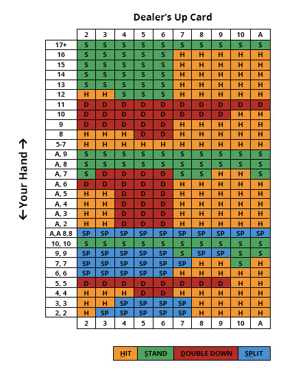
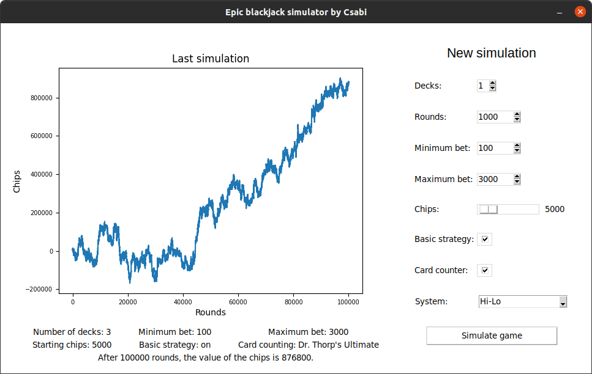

# SOE-ProgAlap2-BlackJack
Kebelei Csaba
# A Blackjack játék
Egy kártyajáték, amit maximum 8 pakli, 52 lapos francia kártyával játszanak. A játékos az osztó ellen játszik és a célja, hogy a játékmenet során a nála lévő lapok összértéke több legyen az osztó lapjainak összértékénél, anélkül, hogy meghaladná a 21-et. A kártyák étrékei:

- 2–10-ig a kártyák annyit érnek, amennyi a névértékük.
- A Bubi, Dáma és Király értéke 10.
- Az ász értéke lehet 1 vagy 11, amelyik előnyösebb a kéz szempontjából. A „puha kéz” Ásza 11-et ér.

Minden kör kezdetén a játékos megtesz egy tétet. Ez le van korlátozva egy minimum és egy maximum tétre. Ezután az osztó két-két lapot oszt a játékosnak és magának. Az osztó második lapján kívül az összes kártya képpel felfelé látható az asztalon. Ekkor 4 eset lehet:
 - A játékos első két lapjának az értéke 21, ezt hívjuk Blackjacknek, ilyenkor a kör véget ér és a játékos a megtett téten kívül, annak másfélszeresét is megkapja.
 - Az osztónak van Blackjackje, ekkor a játékos elveszíti a megtett tétet.
 - Az játékos és az osztó első két lapja egyaránt 21, ilyenkor a játékos visszakapja a megtett tétet, ezenkívül több zsetont nem kap.
 - Nincs 21 értékű kéz az asztalon, ekkor a játék tovább folytatódik.

 Ha a játékos úgy gondolja, hogy az első két lapja elég a győzelemhez, akkor megállhat. Dönthet úgy, hogy még több lapot kér, ezt addig teheti, míg úgy dönt, hogy megáll, vagy ha a kezének az értéke 21 vagy annál több. Ha 21, akkor a játékos nyer és megkapja a megtett tét dupláját. Ha a kézben lévő lapok értéke meghaladja a 21-et, akkor veszít és nem kapja vissza tétet, ezt hívjuk besokallásnak. Az első két lap leosztása utána játékosnak lehetősége van az úgynevezett duplázásra, ilyenkor a tét megduplázódik, és a játékos a kezében lévő lapokhoz csupán egyetlen új lapot kap. Ezenfelül előfordulhat olyan speciális eset, hogy a játékos első két lapja megegyezik, ekkor lehetőség van a splitelésre, vagyis a kezek kettéosztására. Ez esetben mindkét kézre a fő téttel megegyező külön tét vonatkozik. Miután a játékos mindkét kezéhez kapott második lapot, növelheti a kezek értékét, ha lapot kér. Ha elégedett a két keze értékével, megállhat. Split után duplázás, vagy Blackjack nem lehetséges.

 A játékos után az osztó következik. Először felfordítja a második lapját és ezután kérhet lapokat vagy megállhat. Az osztónak 16-nál kötelezően lapot kell kérnie, és 17-nél már kötelezően meg kell állnia. Az osztó az Ász értékét nem tekintheti 1-nek, ha a lapok összértéke az Ász 11-es értékével számolva 17 és 21 közötti. Csak akkor tekintheti 1-nek, ha a lapok összértéke az Ász 11-es értékével számolva meghaladná a 21-et. Ha az osztó besokall vagy a játékos lapjainak az értéke nagyobb, akkor a játékos nyer. Ha az osztó lapjainak az értéke nagyobb, akkor veszít a játékos. Ha kezek értéke megegyezik, akkor döntetlen van.

## Alapstratégia
Ez egy taktika amely különféle lapállásokra különféle magatartást írt elő. Segítségével pontosan tudni fogjuk, mikor álljunk meg, kérjünk még egy lapot, válasszuk ketté a lapjainkat vagy duplázzuk meg a tétünket.

## Lapaszámolás
A BlackJack lapszámolás nem illegális tevékenység, de egyik kaszinó sem tűri. A lapok számolása abból áll, hogy mindig figyelni kell, hogy milyen lapot osztottak le. Az alapérték 0, ehhez kell mindig hozzáadni vagy levonni értékeket a lapszámolási technika alapján. Például az egyik legnépszerűbb technika Hi-Lo, ahol ha a az osztott lap 2, 3, 4, 5 vagy 6, akkor hozzá kell adni 1-et az aktuális számolási értékhez. Ha 10, bubi, dáma, király vagy ász, akkor le kell vonni 1-et. Ha 7, 8 vagy 9-et osztottak, akkor az érték nem változik. Amikor az osztó újra keveri a paklit, a számolási érték újra 0 lesz. Vannak bonyolultabb technikák is, ahol több érték is van.

|                               |   2  |  3 |  4 |   5  |  6 |   7  | 8 |   9  | 10, Q, J, K |  A |
|:-----------------------------:|:----:|:--:|:--:|:----:|:--:|:----:|:-:|:----:|:-----------:|:--:|
|             Hi-Lo             |  +1  | +1 | +1 |  +1  | +1 |   0  | 0 |   0  |     -1      | -1 |
|            Omega II           |  +1  | +1 | +2 |  +2  | +2 |  +1  | 0 |  -1  |     -2      |  0 |
|             Halves            | +0.5 | +1 | +1 | +1.5 | +1 | +0.5 | 0 | -0.5 |     -1      | -1 |
| Dr. Thorp's Ultimate Counting |  +5  | +6 | +8 |  +11 | +6 |  +4  | 0 |  -3  |     -7      | -9 | 

 

Ha több pakli van játékban, akkor ki kell számolni a valódi számolási értéket. A valódi érték kiszámolásánál az aktuális értéket kell elosztani a hátralévő paklik számával. A lepszámolás lényege, hogy minnél nagyobb az érték, annál nagyobb az esély a győzelemre. Az érték segítségével meghatározható az ideális tét: A valódi értékből egyet kell levonni, majd meg kell szorozni a minimum téttel.

# Epic blackjack simulator
A célja, hogy leszimuláljon egy játékot megadott paraméterek alapján. Az új szimulációhoz testreszabhatjuk a következő paramétereket:
- Paklik száma
- Körök száma
- Minimum tét
- Maximum tét
- Kezdő zseton mennyiség
- Alkalmazza-e az alapstratégiát, ha nem, akkor a döntések véletlenszerűek lesznek
- Alkalmazza-e valamelyik lapszámolási technikát, ha nem, akkor a tét mennyisége minden kör elején véletlenszerűen lesz meghatározva
- Melyik lapszámolási technikát alkalmazza 

Az utolsó leszimulált játék az ablak bal oldalán látható egy grafikonon, és alatt szövegesen a hozzá tartozó adatokkal. A szimuláció eltárolja minden kör után a zseton mennyiséget, amit a grafikon ábrázol.
